# Bachelorthesis Julian Altmeyer
## Konzeption und Implementierung einer Architektur zur Verteilung von Steuerungs- und Navigationsaufgaben an Roboter in einem Smart-City-Umfeld

Dieses Projekt ist Teil des Smart City IoT-Testfelds der Hochschule für Technik und Wirtschaft des Saarlandes (HTW Saar).
Bei diesem Testfeld handelt es sich um eine Modellstadt, die mit verschiedenen Sensoren ausgestattet ist um Daten über das Umfeld und die Umwelt zu sammeln. 
Autonome Fahrzeuge sollen zudem verschiedene Aufgaben lösen können.
Dafür muss eine Basis für solche Fahrzeuge geschaffen werden, welches Ziel dieses Projekts ist.

Es soll ein System konzipiert werden, mit dem Raspberry-Pi-Roboter gesteuert werden können.
Dieses System soll aus mehreren Komponenten bestehen.
Dazu zählt ein Frontend, mit dem die Eingabe von Steuerungsbefehlen und das Anzeigen von Statusinformationen ermöglicht wird.
Ein Backend-System für die Navigation, das Sammeln von Informationen und die Übersetzung und Übermittlung der Befehle an den Roboter.
Und die Software, mit der der Roboter gesteuert wird.

Das Backend-System soll in einem Kubernetes Cluster bereitgestellt werden und für die Nachrichtenübermittlung einen bereits existierenden RabbitMQ MQTT Broker verwenden.
Es soll Zustandslos sein, damit mehrere Instanzen parallel laufen können.
Das System soll eine REST-Schnittstelle anbieten, um Steuerungsbefehle zu akzeptieren und Statusinformationen bereitzustellen. 
Die Befehle und Informationen werden in einem passendem Format übertragen.
Es soll angeboten werden einen Roboter direkt zu steuern oder mit Angabe einer Zielkoordinate einen Weg berechnen zu lassen, der anschließend gefahren wird.

Ein Roboter besteht aus einem Raspberry-Pi mit einem BrickPi Aufsatz zum Anschließen von LEGO Motoren und Sensoren. Es werden mehrere Motoren für die Fortbewegung benutzt. Damit der Roboter Kenntnis der Umgebung hat, ist er außerdem mit einer Kamera und einem Ultraschallsensor ausgestattet. Ein Roboter abonniert ein Topic um die Befehle des Backendsystems zu erhalten und eigene Statusinformationen zu senden. Die empfangenen Befehle (z.B. "fahre 10 cm vorwärts") werden in Anweisungen übersetzt, die die Motoren umsetzen können (z.B. "drehe den Motor mit x Leistung für y Sekunden"). Der Roboter soll weiterhin über MQTT Informationen an das Backendsystem senden, wie z.B. Batteriestatus, Koordinaten der aktuellen Position oder auch der Name.

Das Frontendsystem soll eine Webanwendung sein, die ebenfalls im Kubernetes Cluster veröffentlicht wird. Man kann einen Roboter auswählen und ihm direkte Steuerbefehle geben (z.B. fahre x cm vorwärts oder um y° drehen) oder durch eine Angabe von Zielkoordinaten zu einem Ort fahren lassen. Es soll weiterhin eine Kartenansicht geben, auf der die aktiven Roboter mit Ihrem Namen und aktuellen Standort angezeigt werden. Auch Informationen zum aktuellen Batterieladezustand sollen ersichtlich sein. Das System interagiert mit dem Backendsystem über die bereitgestellte REST-API.

## Architektur
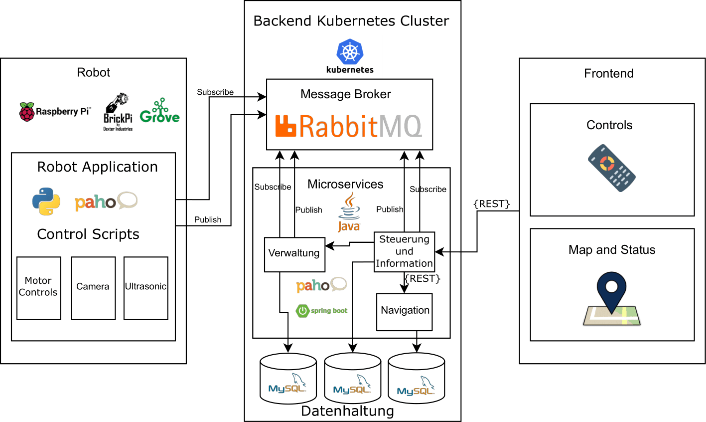

#### **Anforderungen**
An die Systeme werden folgende Anforderungen gestellt.

**Must-Have-Anforderungen:**

Frunktionale Anforderungen:

Roboter:
* Um mit dem Backend-System in Kontakt zu treten, braucht der Roboter einen Client.
* Steuerungsbefehle müssen in Motoranweisungen übersetzt werden.
* Mithilfe eines Ultraschallsensors sollen Hindernisse erkannt werden.
* Informationen müssen regelmäßig von den verschiedenen Sensoren gesammelt und veröffentlicht werden.

Backend:
* Die Kommunikation mit den Robotern und der Benutzeroberfläche müssen ermöglicht werden. Damit zum Beispiel Steuerbefehle ausgetauscht werden können.
* Informationen der Roboter sollen in einer Datenbank gespeichert werden.
* Es soll auf einer existierenden Karte navigiert werden können.
* Mithilfe eines zu bestimmenden Algorithmus soll der kürzeste Weg zwischen zwei Punkten auf der Karte gefunden werden.
* Eine Übersetzung von einem Pfad zu für den Roboter verständlichen Fahrbefehlen muss umgesetzt werden.

Frontend:
* Um Steuerungsanfragen zu stellen und Roboter-Informationen abfragen zu können, muss mit dem Backend-System kommuniziert werden können.

Nichtfunktionale Anforderungen:

Roboter:
* Der Roboter soll einen Raspberry Pi als Computereinheit benutzten.
* Für den Anschluss von Sensoren und Motoren sollen die Erweiterungsplatinen BrickPi und GrovePi eingesetzt werden.
* Es sollen LEGO Mindstorms Motoren und Grove Sensoren verwendet werden.
* Die zu verwendende Kamera ist das Raspberry Pi Camera Module.
* Der Roboter soll aus LEGO Technik zusammengebaut werden.
* Der Roboter soll so klein wie möglich gestaltet werden.
* Die Kommunikation mit dem Backend-System soll mittels des vorhandenen MQTT-Brokers geschehen.

Backend:
* Es muss eine zustandslose Architektur zum Einsatz kommen, da im Cluster auf Containerisierung gesetzt wird.
* Das System soll eine gute Skalierbarkeit aufweisen, damit Arbeitsbelastungen einfach verteilt werden können.
* Das System soll nach Eingang eines Befehls einen Roboter binnen kürzester Zeit zum Fahren bekommen.
* Die Kommunikation mit den Robotern soll über MQTT geschehen.
* Das Backend-System soll mittels REST Informationen teilen und Befehle entgegennehmen.

Frontend:
* Wbe-UI von vorgänger Projekt "Smart-City Cozmo-Steuerung" weitestgehend übernehemen.

**Nice-to-Have-Anforderungen:**

Frunktionale Anforderungen:

Roboter:
* Für die Registrierung soll ein Handshake mit dem Backend-System umgesetzt werden.
* Es soll eine Funktion implementiert werden, mit der man die aktuellen Koordinaten aktualisieren kann.

Backend:
* Roboter sollen sich über einen Handshake mit dem Service registrieren können.
* Es soll erkannt werden, wenn ein Roboter inaktiv wird, und diesen entsprechend kennzeichnen.

Frontend:
* Web-UI des Vorgängerprojektes weitestgehend übernehmen.
* Eine interaktive Kartenansicht, bei der zum Beispiel Zielkoordinaten auswählbar sind.

**Lösungsstrategie**

Es wird für eine Microservice-Architektur für das Backend-System entworfen.
Dafür werden drei Micrsoervices definiert: 
* der Steuerungs- und Informations-Service
* der Navigations-Service
* und der Verwaltungs-Service

### Statisches Modell

Der **Roboter** ist mit dem Backend über das Publish/Subscribe Pattern von MQTT verbunden. Auf dem Kubernetes-Cluster läuft als MQTT-Broker RabbitMQ, mit dem sich die Roboter und die Backend-Services verbinden. Es werden auf mehreren verschiedenen Topics Informationen und Steuerungsbefehle ausgetauscht.

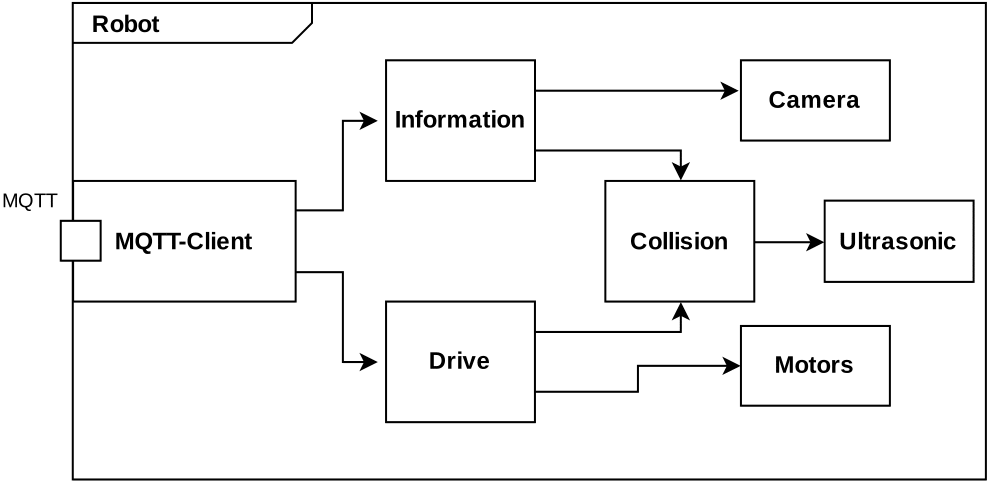

Der **Steuerungs- und Informations-Service** ist der zentrale Service und ist daher in Kommunikation mit allen Bestandteilen des Steuerungssystems.Zum einen muss dieser Service mit dem Frontend kommunizieren können, da über dieses die Steuerungsbefehle erteilt und Informationen geteilt werden. Daher muss eine REST-Schnittstelle angeboten werden. Zum anderen muss der Service diese Steuerungsbefehle übersetzen und mit den Robotern teilen. Dafür muss bekannt sein, welche Roboter existieren und welche momentan aktiv sind. Diese Information bekommt der Service aus der Datenbank. Die Informationen, welche Roboter existieren und welche aktiv sind, werden dabei vom Verwaltungs-Service verwaltet. Wenn ein Steuerungsbefehl eine Wegfindung voraussetzt, muss der Service den Navigations-Service anfragen, um den besten Weg von der aktuellen Roboterposition zum Zielpunkt zu finden.

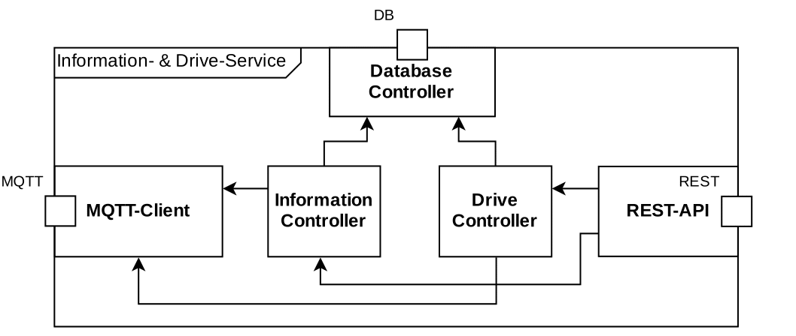

Der **Verwaltungs-Service** hat als Aufgaben Roboter zu registrieren und festzustellen, welche noch aktiv sind.Damit der Steuerungs- und Informations-Service weiß, welche Roboter existieren und welche von diesen aktiv sind, muss der Verwaltungs-Service ebenfalls eine REST-API bereitstellen.Um die Registrierungen von Robotern und deren Aktivitätsrückmeldungen empfangen zu können, muss MQTT verwendet werden.Da die Roboter ausschließlich über MQTT kommunizieren sollen.Die schon angesprochenen Vorteile von MQTT sind auch hier anwendbar.

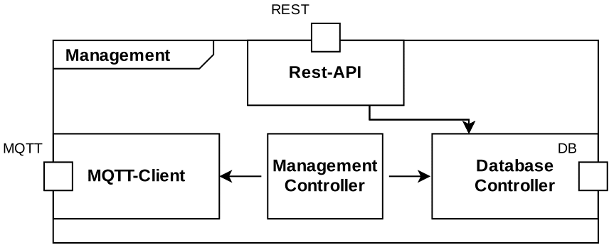

Der **Navigations**-Service stellt eine REST-API bereit, mit der eine Wegfindung angefragt werden kann. Damit kann der Steuerungs- und Informations-Service diese ansprechen, wenn ein Roboter zu einem bestimmten Ziel fahren soll.

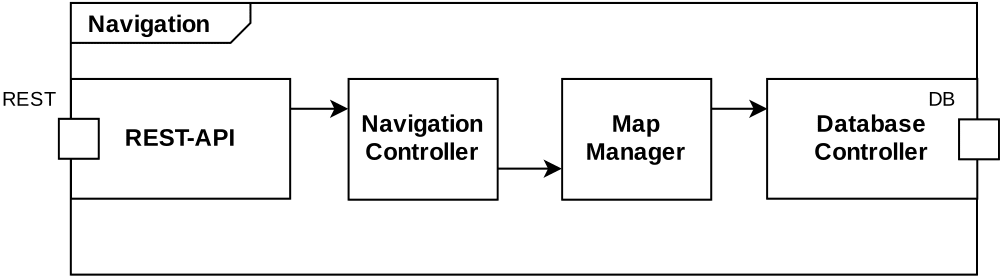

Das **Frontend** hingegen spricht die vom Backend zur Verfügung gestellte REST-API an, um Informationen zu bekommen und Befehle zu senden. Der Vorteil einer REST-Schnittstelle ist, dass später auch gegebenenfalls andere Programme mit dieser API verbunden werden können. Auch ist die Schnittstelle leicht erweiterbar, falls weitere Funktionalitäten implementiert werden sollen. Ein weiterer Vorteil, der für eine REST-API spricht, ist, dass einer der Grundsätze von REST die Zustandslosigkeit der Serverseite vorsieht. Da das Backend Zustandslos implementiert werden soll, passt REST sehr gut für diesen Anwendungsfall.

### Dynamisches Modell

##### Registrierung eines Roboters
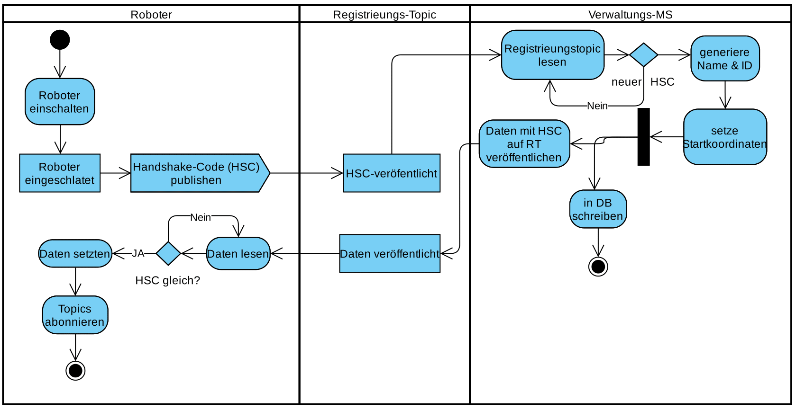

##### Fahrbefehle und Navigation
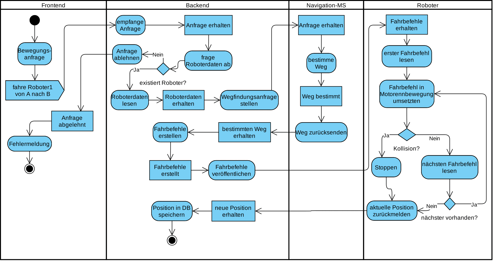

#### Datenbank
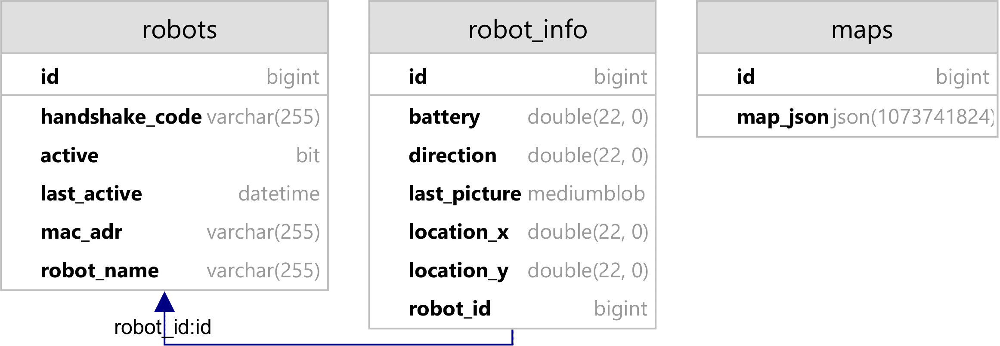

### Schnittstellen Beschreibung
Anschließend werden alle REST-Endpunkte und verwendeten MQTT-Topics aufgeführt.
#### REST-Endpunkte Steuerungs und Verwaltungs-Service
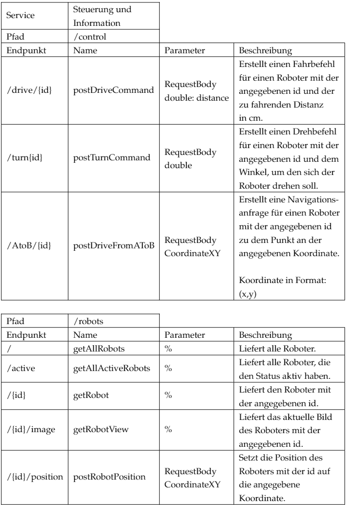

#### REST-Endpunkte Verwaltungs-Service
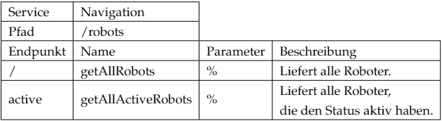

#### REST-Endpunkte Navigations-Service
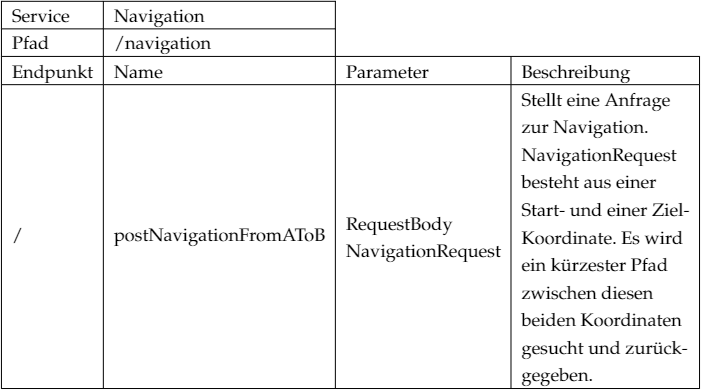

#### Verwendete MQTT-Topics
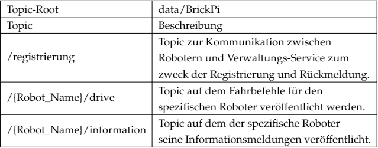

